# FANTASY BATTLE
河原電子ビジネス専門学校　
ゲームクリエイター科2年<br>
氏名：国宇雄飛<br>
## 紹介動画
動画<br>
## 目次
- [FANTASY BATTLE](#fantasy-battle)
  - [紹介動画](#紹介動画)
  - [目次](#目次)
  - [1.作品概要](#1作品概要)
  - [2.担当ソースコード](#2担当ソースコード)
  - [3.操作説明](#3操作説明)
  - [4.ゲーム説明](#4ゲーム説明)
    - [4.1 ゲーム詳細](#41-ゲーム詳細)
    - [4.2 プレイヤーについて](#42-プレイヤーについて)
    - [4.3 武器について](#43-武器について)
    - [4.4 モンスターについて](#44-モンスターについて)
      - [1.モブモンスターの挙動](#1モブモンスターの挙動)
      - [2.ボスの挙動](#2ボスの挙動)
  - [5.その他](#5その他)
    - [5.1.デプスシャドウ](#51デプスシャドウ)
    - [5.2.カスケードシャドウ](#52カスケードシャドウ)
    - [5.3.VSM](#53vsm)
    - [5.4.川瀬式ブルームフィルター](#54川瀬式ブルームフィルター)
    - [5.5.トゥーン調の表現](#55トゥーン調の表現)
      - [1.ランプシェーディング](#1ランプシェーディング)
      - [2.アウトラインの描画](#2アウトラインの描画)
      - [3.簡易リムライト](#3簡易リムライト)


## 1.作品概要
* タイトル 
  * FANTASY BATTLE
* 制作人数
  * 1人
* 製作期間
  * 2023年6月～1月
* ゲームジャンル
  * 3Dアクションゲーム
* プレイ人数
  * 1人
* 使用言語
  * C++
  * HLSL
* 使用ツール
  * Visual Studio 2022
  * Visual Studio Code
  * Adobe Photoshop 2024
  * 3ds Max 2023
  * Effekseer
  * GitHub
  * Fork
  * Notion
* 開発環境
  * 学校内製の簡易エンジン
  * Windows11

## 2.担当ソースコード
<details><summary>
  ゲーム部分
  </summary>
<details><summary>
  ゲームの進行
  </summary>

* BattlePhase.cpp
* BattlePhase.h
* BattleStart.cpp
* BattleStart.h
* BossStage1.cpp
* BossStage1.h
* EntryBoss.cpp
* EntryBoss.h
* Fade.cpp
* Fade.h
* Game.cpp
* Game.h
* GameCamera.cpp
* GameCamera.h
* GameFinishCamera.cpp
* GameFinishCamera.h
* GameUI.cpp
* GameUI.h
* Pause.cpp
* Pause.h
* Result.cpp
* Result.h
* Title.cpp
* Title.h
</details>

<details><summary>
  マネージャー
</summary>

* EventManager.cpp
* EventManager.h
* CharactersInfoManager.cpp
* CharactersInfoManager.h
* GameManager.cpp
* GameManager.h
* ManagerPreCompile.cpp
* ManagerPreCompile.h
* WeaponManager.cpp
* WeaponManager.h
* SoundManager.cpp
* SoundManager.h
</details>
<details><summary>
  プレイヤー
</summary>

* Actor.cpp
* Actor.h
* Player.cpp
* Player.h
<details><summary>
  Brave
</summary>

* Brave.cpp
* Brave.h
* BraveStateAttack_1.cpp
* BraveStateAttack_1.h
* BraveStateAttack_2.cpp
* BraveStateAttack_2.h
* BraveStateAttack_3.cpp
* BraveStateAttack_3.h
* BraveStateChangeSwordShield.cpp
* BraveStateChangeSwordShield.h
* BraveStateDefend.cpp
* BraveStateDefend.h
* BraveStateDefendHit.cpp
* BraveStateDefendHit.h
* BraveStateDie.cpp
* BraveStateDie.h
* BraveStateHit.cpp
* BraveStateHit.h
* BraveStateIdle.cpp
* BraveStateIdle.h
* BraveStateKnockBack.cpp
* BraveStateKnockBack.h
* BraveStateSkill_Main.cpp
* BraveStateSkill_Main.h
* BraveStateSkill_Start.cpp
* BraveStateSkill_Start.h
* BraveStateSprint.cpp
* BraveStateSprint.h
* BraveStateWin_Main.cpp
* BraveStateWin_Main.h
* BraveStateWin_Start.cpp
* BraveStateWin_Start.h
* IBraveState.cpp
* IBraveState.h
</details>

</details>
<details><summary>
  武器
</summary>

* Arrow.cpp
* Arrow.h
* BigSword.cpp
* BigSword.h
* Bow.cpp
* Bow.h
* IWeapon.cpp
* IWeapon.h
* MyWeapon.h
* SwordShield.cpp
* SwordShield.h
* WeaponBase.cpp
* WeaponBase.h
</details>

<details><summary>
  モンスター
</summary>

* AIActor
* AIActor
* Boss
* Boss
* BossBase
* BossBase
* IMobStateMachine
* IMobStateMachine
* MobMonster
* MobMonster
* MobMonsterActionList
* MonsterBase
* MonsterBase
<details><summary>
  Cactus
</summary>

* ICactusState.h
* Cactus.cpp
* Cactus.h
* CactusStateAppear.cpp
* CactusStateAppear.h
* CactusStateAttack_1.cpp
* CactusStateAttack_1.h
* CactusStateChase.cpp
* CactusStateChase.h
* CactusStateDamage.cpp
* CactusStateDamage.h
* CactusStateDie.cpp
* CactusStateDie.h
* CactusStateIdle.cpp
* CactusStateIdle.h
* CactusStatePatrol.cpp
* CactusStatePatrol.h
* CactusStateSkill.cpp
* CactusStateSkill.h
* CactusStateVictory.cpp
* CactusStateVictory.h
</details>
<details><summary>
  Mushroom
</summary>

* IMushroomState.h
* Mushroom.cpp
* Mushroom.h
* MushroomStateAppear.cpp
* MushroomStateAppear.h
* MushroomStateAttack_1.cpp
* MushroomStateAttack_1.h
* MushroomStateChase.cpp
* MushroomStateChase.h
* MushroomStateDamage.cpp
* MushroomStateDamage.h
* MushroomStateDie.cpp
* MushroomStateDie.h
* MushroomStateIdle.cpp
* MushroomStateIdle.h
* MushroomStatePatrol.cpp
* MushroomStatePatrol.h
* MushroomStateSkill.cpp
* MushroomStateSkill.h
* MushroomStateVictory.cpp
* MushroomStateVictory.h
</details>

<details><summary>
  Slime
</summary>

* ISlimeState.h
* Slime.cpp
* Slime.h
* SlimeStateAppear.cpp
* SlimeStateAppear.h
* SlimeStateAttack.cpp
* SlimeStateAttack.h
* SlimeStateChase.cpp
* SlimeStateChase.h
* SlimeStateDamage.cpp
* SlimeStateDamage.h
* SlimeStateDie.cpp
* SlimeStateDie.h
* SlimeStateIdle.cpp
* SlimeStateIdle.h
* SlimeStatePatrol.cpp
* SlimeStatePatrol.h
* SlimeStateSkill.cpp
* SlimeStateSkill.h
* SlimeStateVictory.cpp
* SlimeStateVictory.h
</details>

<details><summary>
  Summoner
</summary>

* ISummonerState.h
* Summoner.cpp
* Summoner.h
* SummonerActionList.h
* SummonerState_Angry.cpp
* SummonerState_Angry.h
* SummonerState_DarkBall.cpp
* SummonerState_DarkBall.h
* SummonerState_DarkSpearEnd.cpp
* SummonerState_DarkSpearEnd.h
* SummonerState_DarkSpearMain.cpp
* SummonerState_DarkSpearMain.h
* SummonerState_DarkSpearStart.cpp
* SummonerState_DarkSpearStart.h
* SummonerState_DarkWall.cpp
* SummonerState_DarkWall.h
* SummonerState_Die.cpp
* SummonerState_Die.h
* SummonerState_DMeteo_Main.cpp
* SummonerState_DMeteo_Main.h
* SummonerState_DMeteo_Start.cpp
* SummonerState_DMeteo_Start.h
* SummonerState_Hit.cpp
* SummonerState_Hit.h
* SummonerState_Idle.cpp
* SummonerState_Idle.h
* SummonerState_KnockBack.cpp
* SummonerState_KnockBack.h
* SummonerState_NAttack_1.cpp
* SummonerState_NAttack_1.h
* SummonerState_NAttack_2.cpp
* SummonerState_NAttack_2.h
* SummonerState_NAttack_3.cpp
* SummonerState_NAttack_3.h
* SummonerState_Summon.cpp
* SummonerState_Summon.h
* SummonerState_Victory.cpp
* SummonerState_Victory.h
* SummonerState_Walk.cpp
* SummonerState_Walk.h
* SummonerState_Warp.cpp
* SummonerState_Warp.h
* SummonerStateEat.cpp
* SummonerStateEat.h
</details>

<details><summary>
  TurtleShell
</summary>

* ITurtleShellState.h
* TurtleShell.cpp
* TurtleShell.h
* TurtleShellStateAppear.cpp
* TurtleShellStateAppear.h
* TurtleShellStateAttack_1.cpp
* TurtleShellStateAttack_1.h
* TurtleShellStateChase.cpp
* TurtleShellStateChase.h
* TurtleShellStateDamage.cpp
* TurtleShellStateDamage.h
* TurtleShellStateDie.cpp
* TurtleShellStateDie.h
* TurtleShellStateIdle.cpp
* TurtleShellStateIdle.h
* TurtleShellStatePatrol.cpp
* TurtleShellStatePatrol.h
* TurtleShellStateSkill.cpp
* TurtleShellStateSkill.h
* TurtleShellStateVictory.cpp
* TurtleShellStateVictory.h
</details>

</details>

<details><summary>
  その他
</summary>

* DamageFont.cpp
* DamageFont.h
* DarkBall.cpp
* DarkBall.h
* DarkMeteo.cpp
* DarkMeteo.h
* DarkSpear.cpp
* DarkSpear.h
* DarkSpearObj.cpp
* DarkSpearObj.h
* DarkWall.cpp
* DarkWall.h
* DecisionMeteoEndpoint.h
* HitDetection.cpp
* HitDetection.h
* InitEffect.cpp
* InitEffect.h
* KnockBack.cpp
* KnockBack.h
* MagicBall.cpp
* MagicBall.h
* Meteo.cpp
* Meteo.h
* SoundFile.cpp
* SoundFile.h
* Status.cpp
* Status.h
</details>

</details>

<details><summary>
  エンジン
  </summary>

太文字は改造のみ
* Bloom.cpp
* Bloom.h
* CameraCollisionSolver.cpp
* CameraCollisionSolver.h
* CascadeShadowMapMatrix.cpp
* CascadeShadowMapMatrix.h
* CollisionObject.cpp
* CollisionObject.h
* DoF.cpp
* DoF.h
* FontRender.cpp
* FontRender.h
* IRenderer.h
* **k2EngineLow.cpp**
* **k2EngineLow.h**
* Level3DRender.cpp
* Level3DRender.h
* Light.cpp
* Light.h
* ModelRender.cpp
* ModelRender.h
* MyRenderer.h
* PostEffect.cpp
* PostEffect.h
* PostEffectComponentBase.cpp
* PostEffectComponentBase.h
* RenderingEngine.cpp
* RenderingEngine.h
* Shadow.cpp
* Shadow.h
* SkyCube.cpp
* SkyCube.h
* SpringCamera.cpp
* SpringCamera.h
* SpriteRender.cpp
* SpriteRender.h

</details>

<details><summary>
  シェーダー
  </summary>

* debugWireFrame.fx
* DeferredLighting.fx
* DepthOfFeild.fx
* DrawShadowMap.fx
* gaussianBlur.fx
* hexaBlur.fx
* model.fx
* Model_srv_uav_register.h
* ModelVSCommon.h
* postEffect.fx
* RenderToGBufferFor3DModel.fx
* Sampler.h
* Shadowing.h
* Shadowing_const.h
* skyCubeMap.fx
* sprite.fx
* ZPrepass.fx


</details>

## 3.操作説明


## 4.ゲーム説明

### 4.1 ゲーム詳細
  
このゲームは、制限時間内にステージのボスを倒すとゲームクリアになります。  
プレイヤーは、ソード＆シールド、グレイトソード、ボウ＆アローの3つの武器を使い分けて戦います。  
バトルにはフェーズが存在し、一定時間ごとにフェーズが進み、敵を生成します。フェーズが進行すると、前のフェーズに存在したモブモンスターは消滅します。第4フェーズに進行すると、モブモンスターが出現しない時間となりフェーズ終了後、第1フェーズに戻り以降ループします。
#### [目次に戻る](#目次)

### 4.2 プレイヤーについて
プレイヤーの状態はステートパターンを利用してステートで管理しています。また、ポリモーフィズムを利用することで同じ変数で違う処理を行えるようにし、行動の追加を容易にしました。
同じステートが武器の数だけあると、状態遷移する際に武器の違いによる処理が複雑になるため、全ての武器で同じステートを利用できるようにしました。  
```c++
// アニメーションクリップの番号を表す列挙型。
enum EnAnimationClip {
	enAnimClip_Idle,
	enAnimClip_Sprint,
        ・
        ・
        ・
	enAnimClip_Num
};

//メイン武器のアニメーションクリップの最初の番号
const int m_mainWeaponAnimationStartIndexNo = 0;						
//サブ武器のアニメーションクリップの最初の番号
const int m_subWeaponAnimationStartIndexNo = enAnimClip_Num * 1;		
//サブ２武器のアニメーションクリップの最初の番号
const int m_subWeapon2AnimationStartIndexNo = enAnimClip_Num * 2;
// アニメーションクリップ。アニメーションの数×武器の数。
AnimationClip	m_animationClip[enAnimClip_Num * AnimationClipGroup_Num];
```  
アニメーションクリップの総数に武器のアニメーションクリップの最初の番号を足してアニメーションをロードしました。
```c++
/// <summary>
/// ソード＆シールドのアニメーションクリップのロード
/// </summary>
/// <param name="mainWeaponAnimationStartIndexNo">アニメーションクリップの最初の番号</param>
void Brave::RoadOneHandSwordAnimationClip(int mainWeaponAnimationStartIndexNo)
{
  // 片手剣のアニメーションクリップをロードするためのペアクラス
  const std::pair<const char*, bool> oneHandedSwordAnimClipFilePaths[] = {  {"Assets/animData/character/Player/OneHandSword/Idle.tka",true},  {"Assets/animData/character/Player/OneHandSword/Sprint.tka",true},
          ・
          ・
          ・
{"None",false}
  };
  //設定したoneHandedSwordAnimClipFilePathsを使ってアニメーションクリップをロード、ループフラグを設定
  //enAnimClip_Numはアニメーションクリップの数
  //mainWeaponAnimationStartIndexNoは武器のアニメーションクリップの最初の番号
  for (int i = 0; i < enAnimClip_Num; i++) {
	  m_animationClip[mainWeaponAnimationStartIndexNo + i].Load(oneHandedSwordAnimClipFilePaths[i].first);
	  m_animationClip[mainWeaponAnimationStartIndexNo + i].SetLoopFlag(oneHandedSwordAnimClipFilePaths[i].second);
  }
}
```
この関数が武器ごとに存在しています。mainWeaponAnimationStartIndexNoの値がそれぞれの武器のアニメーションクリップの最初の番号になっています。  
最終的にm_animationClip[]にはこのように格納されます。  
```c++
m_animationClip[]={
  ソード＆シールドの時のアニメーション × enAnimClip_Num,
  グレイトソードの時のアニメーション × enAnimClip_Num,
  ボウ＆アローの時のアニメーション × enAnimClip_Num,
};
```  
| 武器の種類 | アニメーションクリップ名        | 番号 | 
| :-------: | :----------------------------: | :---------: | 
| ソード＆シールド | 待機  | 0 = ソード＆シールドの最初のアニメーションクリップ番号     | 
| 〃              | 移動  | 1       | 
| 〃              | 攻撃  | 2       | 
| グレイトソード   | 待機  | 3 = グレイトソードの最初のアニメーションクリップ番号      | 
| 〃              | 移動  | 4       | 
| 〃              | 攻撃  | 5       | 
| ボウ＆アロー     | 待機  | 6 = ボウ＆アローの最初のアニメーションクリップ番号       | 
| 〃              | 移動  | 7       | 
| 〃              | 攻撃  | 8       | 

アニメーションを再生する際に、再生したいアニメーションクリップの番号と現在の武器のアニメーションクリップの最初の番号を足すことで、武器ごとに使うステートを変えずにアニメーションを再生できるようにしました。  
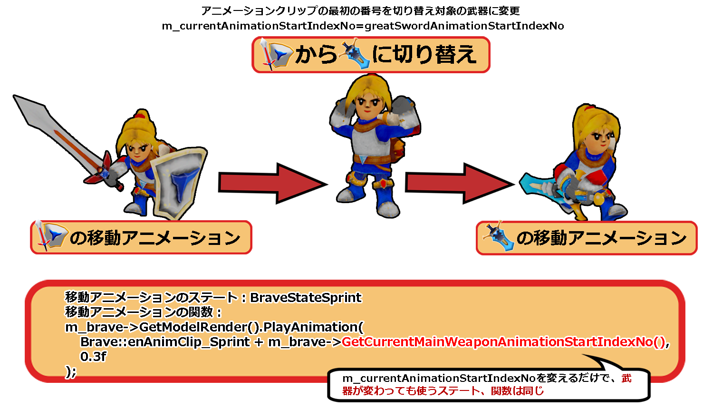  

#### [目次に戻る](#目次)

### 4.3 武器について

武器の座標、回転は、主人公のモデルの手のボーンからワールド座標を取得して設定しています。ですが、主人公の向きによって回転の仕方がおかしくなっていました。  
動画  
<video width="320" height="240" controls>
  <source src="README_IMAGE\movie\Game.exe 2024.01.08 - 15.26.16.02.DVR.mp4" type="video/mp4">
  Your browser does not support the video tag.
</video>

この時点でのワールド座標の設定の仕方
```c++
/// <summary>
/// 行列を設定。
/// </summary>
/// <param name="rotation">行列。</param>
void SetWorldMatrix(const Matrix& matrix)
{
	Vector3 position;
	position.x = matrix.m[3][0];
	position.y = matrix.m[3][1];
	position.z = matrix.m[3][2];
	SetPosition(position);
	Quaternion rotation;
  //回転成分を抽出して
	rotation.SetRotation(matrix);
	SetRotation(rotation);
}
```
原因は,rotation.SetRotation(matrix)で回転を設定する際のmatrixの回転成分が正規化されたものではないからでした。読み込んだモデルのボーンの拡大率が変更されていたため、上記のコードの回転の設定の仕方では、回転成分に拡大縮小成分が混ざっていて、正規化されていなかったので武器の向きがおかしくなっていました。  
画像


<div style="text-align: right;">

#### [目次に戻る](#目次)
</div>

### 4.4 モンスターについて
モンスターは、ボスモンスターとモブモンスターの2種類が存在しています。  

モブモンスター
<table>
<tr>
<td>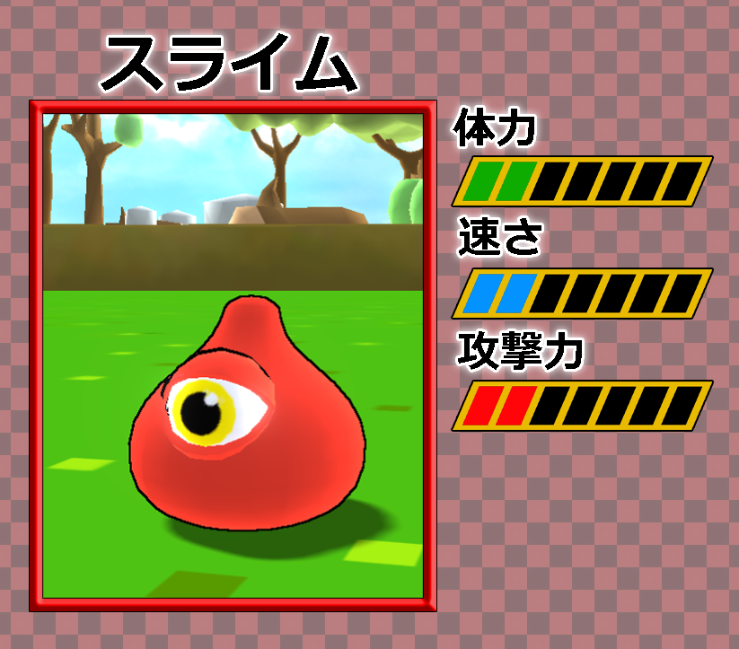</td>
<td>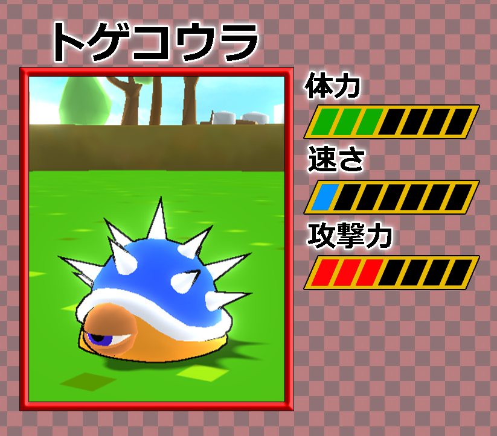</td>
<td>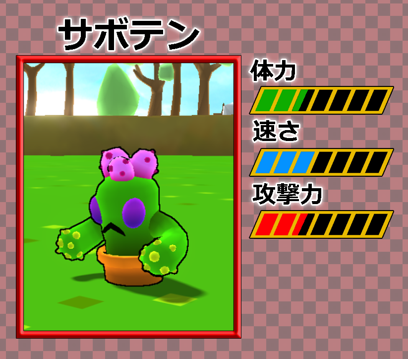</td>
<td>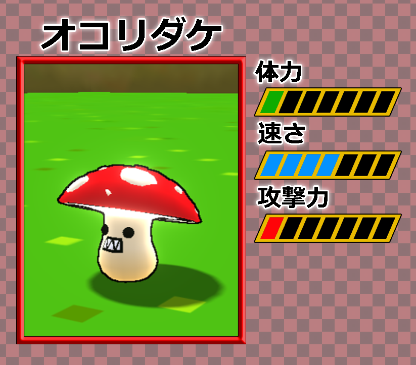</td>
</tr>
</table>  
ボスモンスター
<table>
<tr>
<td>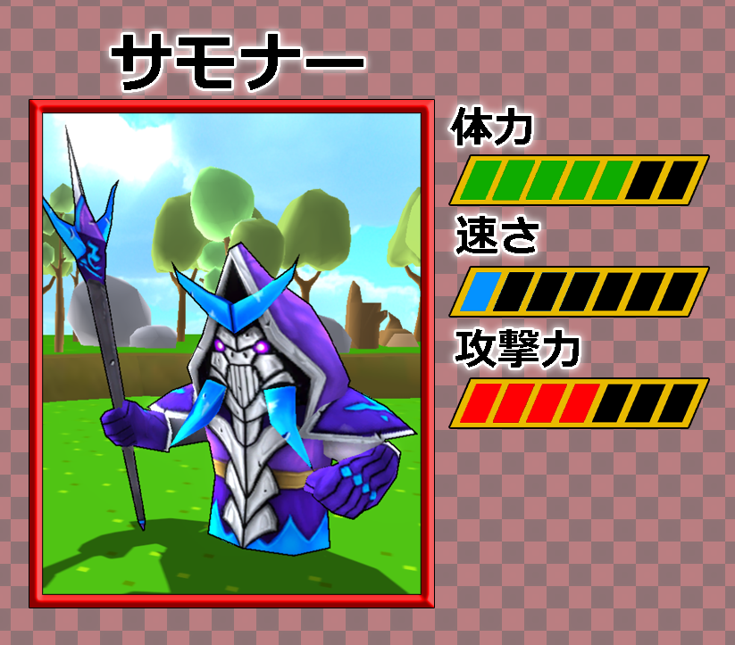</td>
</tr>
</table>


モンスターの状態も主人公と同様ステートパターンで管理しています。
そして、モンスターの行動を管理、調整、追加をしやすくするために、階層型ステートマシンを作成しました。階層型ステートマシンを作成した理由は、単にステートを増やしていくと遷移条件の管理や変更が大変だったためです。ステートを階層化することで、ステートを内包するより大きなステートを形成しました。その結果、状態の管理、追加、変更が容易くなりました。  
画像  

#### 1.モブモンスターの挙動
モブモンスターは「追跡」と「巡回」の2つのステートマシンを作成しました。
「巡回」ステートマシンでは、自由に移動します。敵を発見すると「追跡」ステートマシンに遷移し、敵を追いかけ、攻撃します。  
また、全てのモブモンスターで共通のステートマシンを使うことで、追跡距離や視野角をモブモンスター側で変更するだけで、モンスターによって違った動きができます。
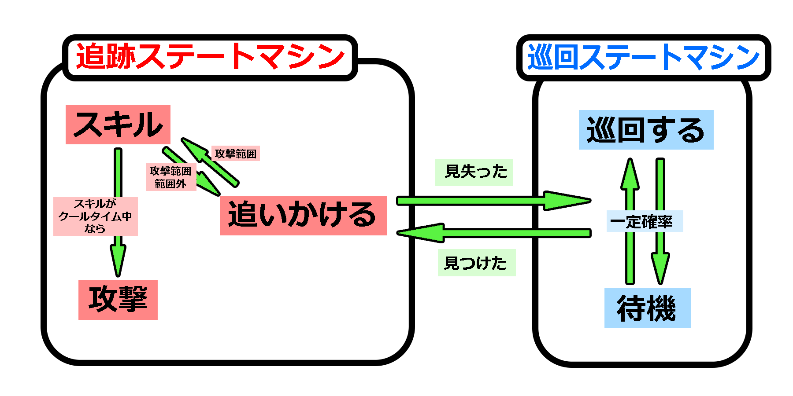  


<div style="text-align: right;">

#### [目次に戻る](#目次)
</div>

#### 2.ボスの挙動
ボスは「警戒」と「攻撃」の2つのステートマシンを作成しました。「警戒」ステートマシンでは、ボスはその場から動かず、常にプレイヤーに目線を向けます。またプレイヤーがしばらくの間近くにいると、ノックバック攻撃を行ってプレイヤーを自身から遠ざけます。一定時間待機すると「攻撃」ステートマシンに遷移し、プレイヤーの距離によって違った攻撃を行います。
  

<div style="text-align: right;">

#### [目次に戻る](#目次)
</div>

## 5.その他

### 5.1.デプスシャドウ
デプスシャドウは「影はライトの光が遮られている場所に落ちるはずなので、影の落ちる箇所には、手前に遮蔽物があるはず」という考え方をもとに影を落とします。
そして、投影シャドウの欠点である、影が落ちないはずの場所に落ちてしまう、セルフシャドウが行えない、ということを解決することができます。  
アルゴリズムは、シャドウマップにZ値を書き込み、ライトビュースクリーン空間でのZ値を計算します。そしてシャドウマップに書き込まれているZ値と比較しして手前が遮蔽されていたら影を落とします。  
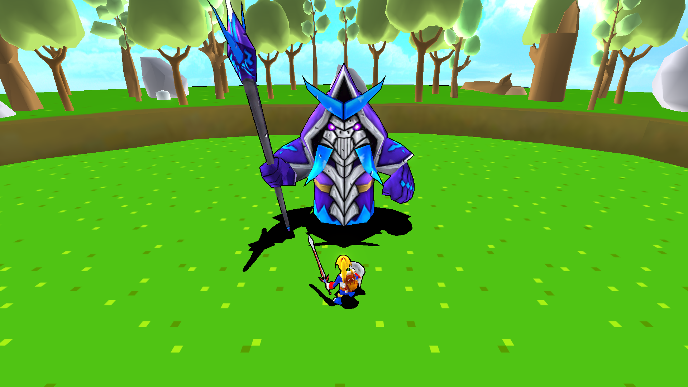  
1.まず、Z値を書き込んだレンダリングターゲットを作成します。  
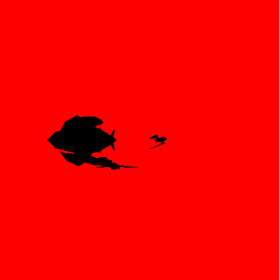  
2.ライトビュースクリーン空間でのZ値を計算します。  
```h
//ライトビュースクリーン空間の座標を計算する
float4 posInLVP = mul( mlvp[cascadeIndex], float4( worldPos, 1.0f ));
```
3.最後に、シャドウマップに書き込まれているZ値とピクセルのZ値を比較し、遮蔽されていたら影を落とします。  
```h
//ライトビュースクリーン空間からUV座標系に座標変換
float2 shadowMapUV=posInLVP.xy/posInLVP.w;
float zInLVP=posInLVP.z/posInLVP.w;
shadowMapUV *= float2(0.5f, -0.5f);
shadowMapUV += 0.5f;

// シャドウマップから値をサンプリング
float4 shadowValue = shadowMap[cascadeIndex].Sample(
    g_sampler, shadowMapUV
);

//シャドウマップUVがUV座標系の範囲内か判定
//0.02f＜zInLVP＜0.98fのとき、影を落とす
 if(shadowMapUV.x >= 0.0f && shadowMapUV.x <= 1.0f &&
 shadowMapUV.y >= 0.0f && shadowMapUV.y <= 1.0f &&
 zInLVP<0.98f&&zInLVP>0.02f)
 {
    shadow=0.5f;
 }

//テクスチャカラーを黒くする。
albedoColor.xyz *= shadow;

```


<div style="text-align: right;">

#### [目次に戻る](#目次)
</div>

---

### 5.2.カスケードシャドウ

デブスシャドウでは、フィールド全体に影を描画しようとするとレンダリングターゲットのサイズの外(特に遠方)は影が描画されなくなり不自然になるため、カスケードシャドウを実装しました。また、レンダリングターゲットを近影用、中影用、遠影用の3つを作成し、遠方に向かうほどレンダリングターゲットの解像度を落とすことで処理を軽減できました。  
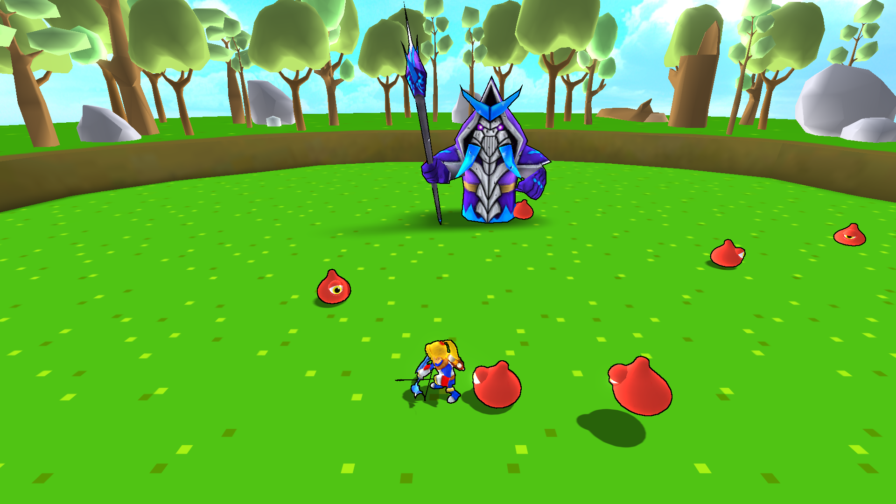  
1.カメラからどこまでの距離を「近距離」「中距離」「遠距離」とするか、分割エリアを定義しました。そして、「近影」「中影」「遠影」のシャドウマップを書き込むレンダリングターゲットを用意しました。
```h
//分割エリアの最大深度値の定義
float m_cascadeAreaRateArray[NUM_SHADOW_MAP] = { 
	800.0f,               //近距離
	2000.0f,              //中距離
	g_camera3D->GetFar()  //遠距離
};
```
```h
RenderTarget m_shadowMaps[3];		//シャドウマップ

//近影用のシャドウマップ
m_shadowMaps[0].Create(
	2048,             //レンダリングターゲットの幅
	2048,             //レンダリングターゲットの高さ
	1,                //ミップマップレベル
	1,                //テクスチャ配列のサイズ
	colorFormat,      //カラーバッファのフォーマット。
	depthFormat,      //深度ステンシルバッファのフォーマット。
	clearColor        //クリアカラー
);
//中影用のシャドウマップ
m_shadowMaps[1].Create(
	1024,1024,
	1,1,
	colorFormat,depthFormat,
	clearColor
);
//遠影用のシャドウマップ
m_shadowMaps[2].Create(
	512,512,
	1,1,
	colorFormat,depthFormat,
	clearColor
);
```

この場合だと、カメラから距離500.0f未満が「近距離」、
500.0f以上2000.0f未満が「中距離」、2000.0f以上カメラから遠平面未満を「遠距離」としています。  
2.分割エリアの定義に従って各距離のオブジェクトを適切なシャドウマップに描画するために、ライトビュープロジェクション行列を計算します。  
a.ライトビュープロジェクションクロップ行列の配列を定義します。「近」「中」「遠」の3エリアをシャドウマップに描画するので、配列を3つ用意しました。
```h
Matrix mLVP[NUM_SHADOW_MAP];					//ライトビュープロジェクション行列
```
b.分割エリアを内包する視錐台の8頂点を求めます。視錐台は下の図のようになっており、○でマークしている頂点を、エリアごとに求めます。求める頂点数は、各エリアで8頂点、エリアが3つあるので、(8×3=)24頂点ですが、重複する頂点があるので、16頂点となります。  
   

```h
//カメラの前方向、上方向、右方向を求める	
const auto& cameraForward = g_camera3D->GetForward();
const auto& cameraRight = g_camera3D->GetRight();
//エリアの数だけ繰り返す(近、中、遠の3つ)
for (int areaNo = 0; areaNo < NUM_SHADOW_MAP; areaNo++)
{
	//エリアを内包する視錐台の８頂点を求める
	//エリアの近平面の中心からの上面、下面までの距離を求める
	float nearY = tanf(g_camera3D->GetViewAngle() * 0.5f) * nearDepth;

	// エリアの近平面の中心からの右面、左面までの距離を求める
	float nearX = nearY * g_camera3D->GetAspect();

	// エリアの遠平面の中心からの上面、下面までの距離を求める
	float farY = tanf(g_camera3D->GetViewAngle() * 0.5f) * cascadeAreaRateTbl[areaNo];

	// エリアの遠平面の中心からの右面、左面までの距離を求める
	float farX = farY * g_camera3D->GetAspect();

	// エリアの近平面の中心座標を求める
	Vector3 nearPos = g_camera3D->GetPosition() + cameraForward * nearDepth;

	// エリアの遠平面の中心座標を求める
	Vector3 farPos = g_camera3D->GetPosition() + cameraForward * cascadeAreaRateTbl[areaNo];

	// 8頂点を求める
	Vector3 vertex[8];
	// 近平面の右上の頂点
	vertex[0] += nearPos + cameraUp * nearY + cameraRight * nearX;
	// 近平面の左上の頂点
	vertex[1] += nearPos + cameraUp * nearY + cameraRight * -nearX;
	// 近平面の右下の頂点
	vertex[2] += nearPos + cameraUp * -nearY + cameraRight * nearX;
	// 近平面の左下の頂点
	vertex[3] += nearPos + cameraUp * -nearY + cameraRight * -nearX;
	// 遠平面の右上の頂点
	vertex[4] += farPos + cameraUp * farY + cameraRight * farX;
	// 遠平面の左上の頂点
	vertex[5] += farPos + cameraUp * farY + cameraRight * -farX;
	// 遠平面の右下の頂点
	vertex[6] += farPos + cameraUp * -farY + cameraRight * farX;
	// 遠平面の左下の頂点
	vertex[7] += farPos + cameraUp * -farY + cameraRight * -farX;
}
```
c.bで求めた各エリアの8頂点をライトビュープロジェクション空間に変換し、8頂点の最大値と最小値を求めます。ライトビュープロジェクション空間は、ライトの視点から見たビュープロジェクション座標系のことを指します。
```h
// 8頂点をライトビュープロジェクション空間に変換して、
// 8頂点の最大値、最小値を求める
Vector3 vMax, vMin;
vMax = { -FLT_MAX, -FLT_MAX, -FLT_MAX };
vMin = { FLT_MAX,  FLT_MAX,  FLT_MAX };
for (auto v : vertex)
{
  //頂点にライトビュープロジェクション行列を乗算
	lvpMatrix.Apply(v);
  //最大値
	vMax.Max(v);
  //最小値
	vMin.Min(v);
}
```
d.先ほどbで求めた頂点を、正規化スクリーン座標系において-1～1の範囲に収めるためにクロップ行列を求めます。クロップ行列は拡大行列×平行移動行列で求めることができるので、拡大率と平行移動量を求めます。  
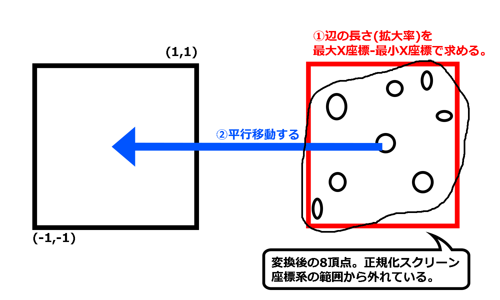  
まず、拡大率を求めます。正規化スクリーン座標系の幅と高さは2なので、拡大率は次のプログラムで求めます。
```h
//正規化スクリーン座標系の幅と高さが2
//AABBが正規化スクリーン座標系にフィットするような拡大率をもとめる
float xScale = 2.0f / (vMax.x - vMin.x);
float yScale = 2.0f / (vMax.y - vMin.y);
```
次に、平行移動量を求めます。  
```h
	//座標を-1から1に収まるようにずらす
	float xOffset = (vMax.x + vMin.x) * -0.5f * xScale;
	float yOffset = (vMax.y + vMin.y) * -0.5f * yScale;
```
求めた拡大率と平行移動量を利用して、クロップ行列求めます。そして、ライトビュープロジェクション行列にクロップ行列を乗算し、ライトビュープロジェクションクロップ行列を作成しました。  
```h
//クロップ行列を求める
Matrix clopMatrix;
clopMatrix.m[0][0] = xScale;
clopMatrix.m[1][1] = yScale;
clopMatrix.m[3][0] = xOffset;
clopMatrix.m[3][1] = yOffset;
// ライトビュープロジェクション行列にクロップ行列を乗算する
m_lvpcMatrix[areaNo] = lvpMatrix * clopMatrix;
```
e.作成した行列を使ってシェーダー側で座標変換し、シャドウマップを使って影を落としました。


<div style="text-align: right;">

#### [目次に戻る](#目次)
</div>

---

### 5.3.VSM
影の境界線がジャギーになっていて見栄えがあまり良くなかったので、ソフトシャドウを実装しました。また、ソフトシャドウの中でも品質の高いVSM(Variance Shadow Maps)を実装しました。VSMとはシャドウマップに書き込まれた**深度値の局所的な分散**を利用してソフトシャドウを実現するアルゴリズムです。  
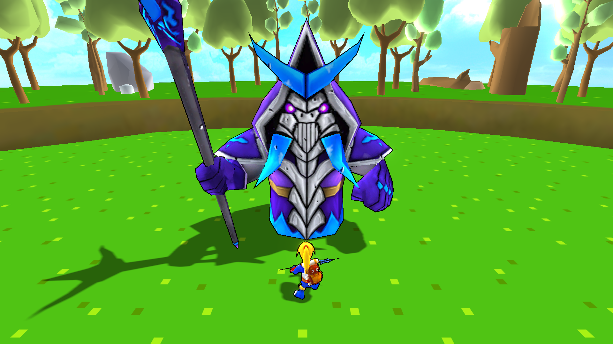  

1.シャドウマップにシャドウライトから見たピクセルまでの距離(深度値)と、先ほどの深度値の2乗を書き込みます。深度値を2乗した値は分散を計算するときに使われます。
```h
 float depth = psIn.pos.z ;
 float pos = exp(INFINITY * depth);
 return float4(pos, pos * pos, 0.0f, 1.0f);
```
深度値を書き込んだシャドウマップ(近影、中影、遠影)  
<table>
<tr>
<td>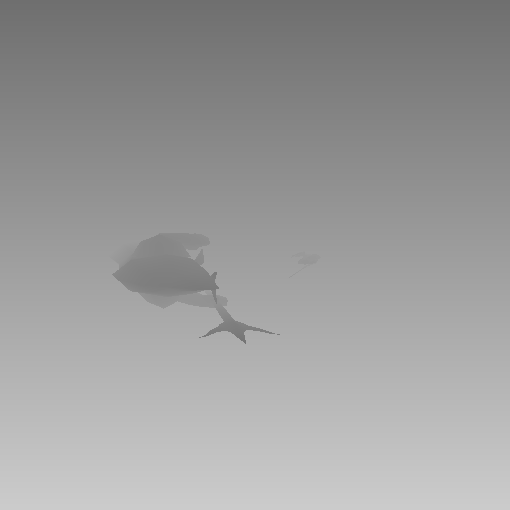</td>
<td>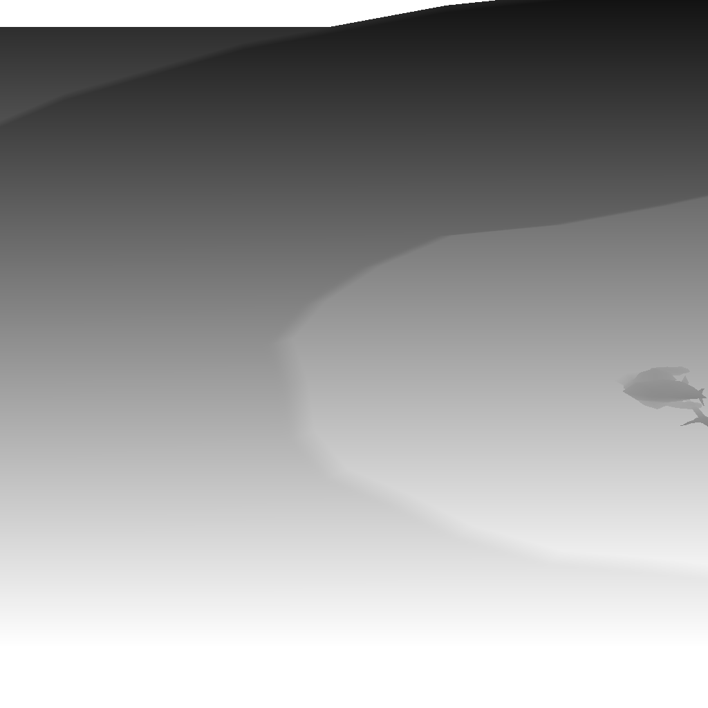</td>
<td>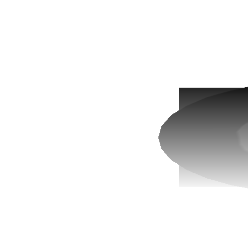</td>
</tr>
</table>

2.作成したシャドウマップにガウシアンブラーをかけシャドウマップにブラーをかけます。  
元のテクスチャの1/4サイズのテクスチャを作成することで、4×4ブロックで局所的な平均を計算出来ます。

画像

3.チェビシェフの不等式を使用して光が当たる確率を求めます。
```h
//moments...シャドウマップからサンプリングした値
//depth...ピクセルの深度値

// 遮蔽されているなら、チェビシェフの不等式を利用して光が当たる確率を求める
float depth_sq = moments.x * moments.x;
// このグループの分散具合を求める
// 分散が大きいほど、varianceの数値は大きくなる
float variance = moments.y-depth_sq;
//このピクセルのライトから見た深度値とシャドウマップの平均の深度値の差を求める 
float md  = depth - moments.x;
// 光が届く確率を求める
float lig_factor = variance / (variance + md * md);
float lig_factor_min = 0.3f;
// 光が届く確率の下限以下は影になるようにする。
lig_factor = saturate((lig_factor - lig_factor_min) / (1.0f - lig_factor_min));
// 光が届く確率から影になる確率を求める。影の濃さ
return (1.0f - lig_factor);
```
4.影の濃さをライティングしたカラーに乗算する。
```h
 albedoColor.xyz *= (1.0f - shadow);
```

<div style="text-align: right;">

#### [目次に戻る](#目次)
</div>

---

### 5.4.川瀬式ブルームフィルター
ポストエフェクトの1つのブルームの、川瀬正樹氏が発表した川瀬式ブルームフィルターを実装しました。HDRレンダリングでは、ガウシアンブラーを一度しかかけないため、強い光が当たった時に光がきれいに広がりません。ですが、川瀬式ブルームフィルターでは、ダウンサンプリングしながらガウシアンブラーを複数回かけて、それらを同解像度に拡大合成することであふれテクスチャを生成します。そうすることで、光がきれいに広がるようになります。    
1.メインレンダリングターゲットにモデルを描画したスプライトから輝度抽出し、スプライトを描画します。  
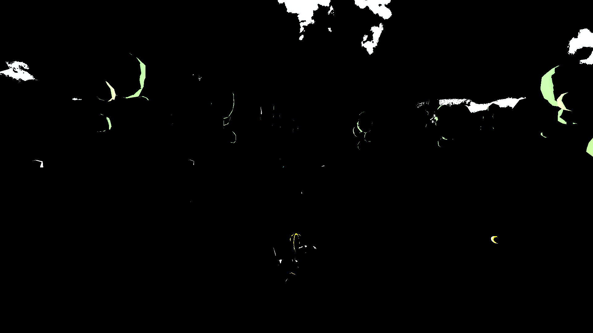  

2.輝度を抽出したテクスチャに4回ダウンサンプリングしながらガウシアンブラーをかけ、ボケ画像を作成します。  
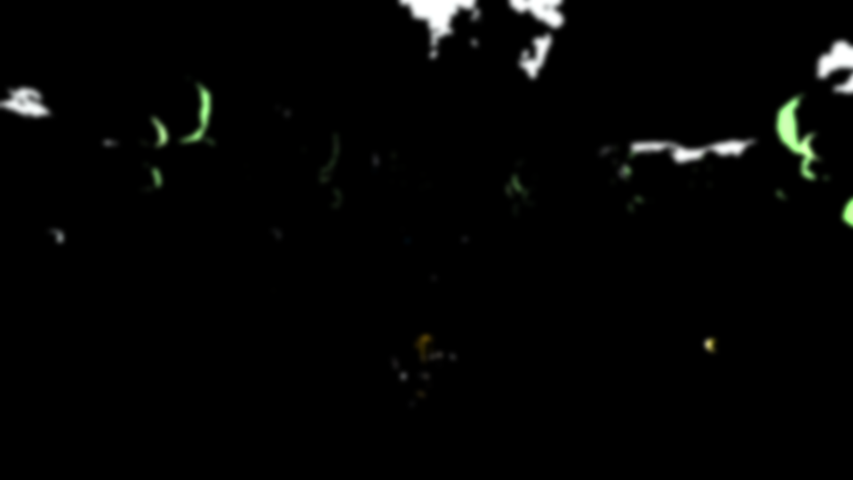
  

  

3.4枚のボケ画像を合成してシーンに加算合成します。  
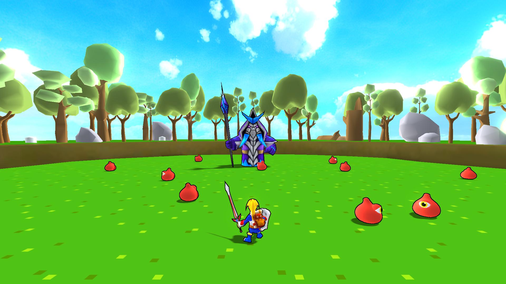  

<div style="text-align: right;">

#### [目次に戻る](#目次)
</div>

---

### 5.5.トゥーン調の表現
トゥーン調のゲームを作りたいと思っていたので、等身の低いキャラクターモデルや陰影のないテクスチャを用いました。また、グラフィック面での表現は、アウトラインの描画、ランプシェーディング、簡易リムライトを実装しました。
  #### 1.ランプシェーディング
ランプシェーディングを用いることで、陰影をはっきりさせることでトゥーン調の表現をしました。ランプシェーディングでは、ランプテクスチャから影の色を決めます。そして、ライティングの計算を行った後、その値をUV座標のX成分としてランプテクスチャからライティングした値をフェッチします。 
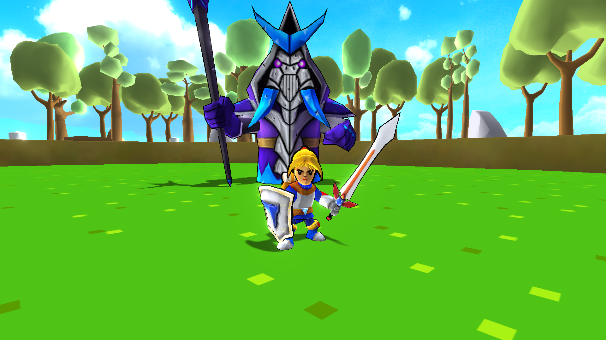  
1.まず、モデル別にランプテクスチャを用意しました。  
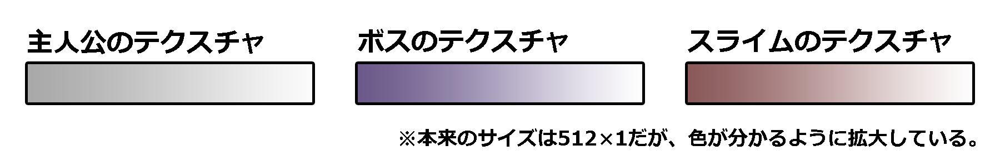  
また、ライティングした値をフェッチする際に使うのはX成分だけなので、ランプテクスチャの高さ(Y成分)を1にすることで、画像のサイズを小さくし、メモリの使用量を削減しました。  
その結果、**キャッシュヒット率**を上げ、データの読み取り速度を向上させることができました。 
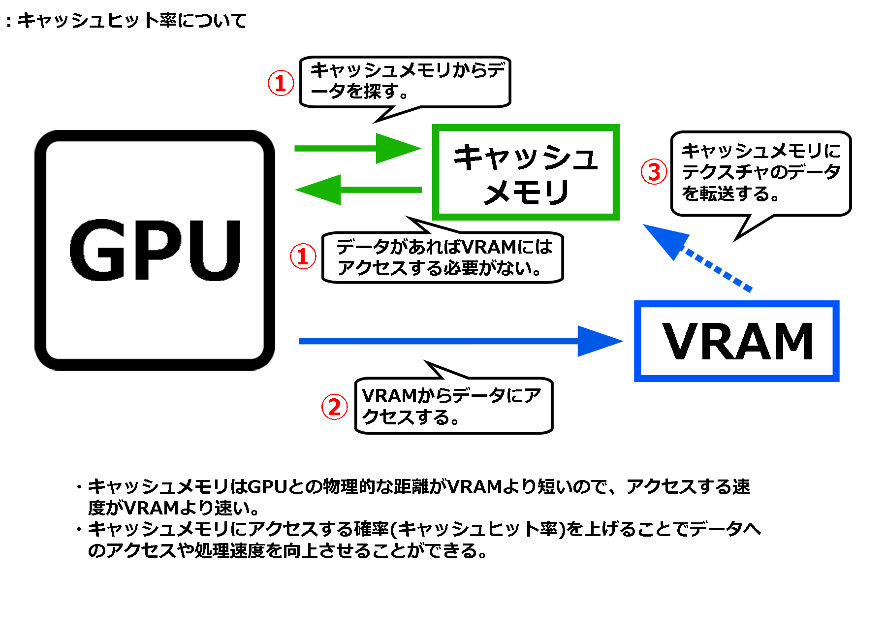   
ランプテクスチャのサイズを小さくした理由は、
無駄にVRAMにアクセスする必要がないようにするためです。
キャッシュメモリの容量は少ないです。そのため、キャッシュメモリにデータを転送してもキャッシュメモリの容量を超えてしまうと、元々入っていたデータを上書きすることになり、上書きされたデータを呼び出すときはVRAMからアクセスしないといけなくなるからです。 


2.法線とディレクションライト(ライトの方向ベクトル)の内積を計算し、その値を0から1の間にクランプします。  
```h
//ハーフランバート拡散照明によるライティング計算
	float p=dot(psIn.normal*-1.0f,lightDirection.xyz);
  //内積を0から1の範囲にクランプする
	p=saturate(p*0.5f+0.5f);
```
smoothstep(min,max,x)関数を使って、xがminからmaxの間なら、minからmaxの間のスムーズなエルミート補間を返します。そうすることで、影と影ではない部分の境目をグラデーションのようにできます。minとmaxの値の差が大きいほど緩やかなグラデーションとなります。
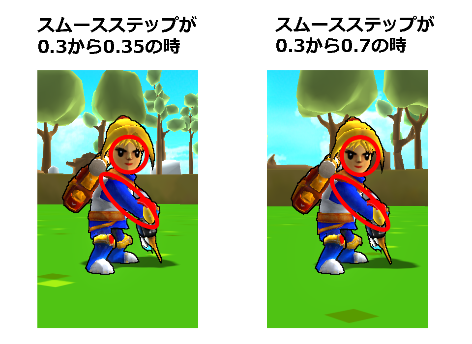  

次に、計算結果よりランプテクスチャからサンプリングしてフェッチします。  
```h  
	//スムースステップし、0から1の間にクランプする
	p = saturate(smoothstep(0.3, 0.35, p));
	//ランプテクスチャからサンプリング
	float4 Color=g_toonMap.Sample(g_sampler,float2(p,0.5f));
```
最後に、フェッチした色をライティングしたカラーに乗算しました。 


  #### 2.アウトラインの描画
アウトラインの描画はトゥーン調の表現を行うためによく行われるため、実装しました。キャラクターのみにアウトラインを描画することで存在感が強くなっていると思います。  
ポストエフェクトでアウトラインの描画を行うと、シーン全体にアウトラインが発生し、望んでいない箇所にアウトラインが発生してしまいます。これらを解決するために、フォワードレンダリングでアウトラインの描画を行い、モデルごとにアウトラインを描画するか決められるようにしました。 
アウトラインの描画のアルゴリズムは、隣り合うピクセル同士の深度値の差が一定以上なら「アウトラインが発生している」と判断し、ピクセルカラーを黒くして出力します。   
 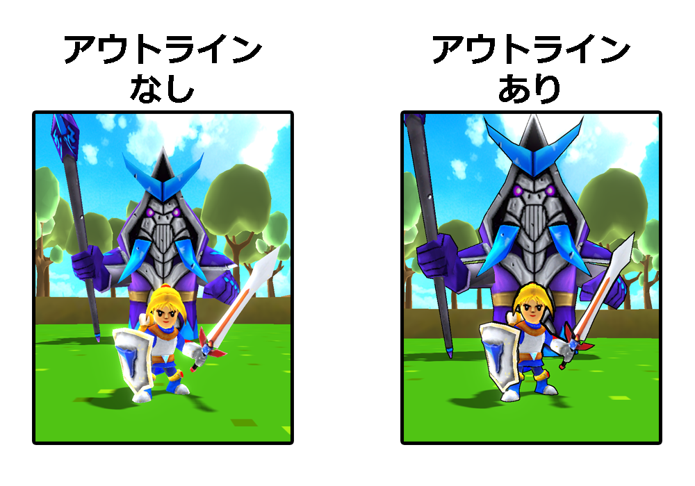  
1.まず、ピクセル同士の深度値を比べるために、ZPrepassと呼ばれるシーンの深度値を書き込んだレンダリングターゲットを作成します。  
画像  
2.ピクセルの正規化スクリーン座標系の座標が必要になるので、頂点シェーダーから透視変換後の座標を出力します。
```h
//頂点の正規化スクリーン座標系の座標をピクセルシェーダーに渡す
psIn.posInProj = psIn.pos;
//正規化する
psIn.posInProj /= psIn.posInProj.w;
```
3.ZPrepassを利用して近傍8テクセルの深度値の平均値を計算し、これから描画するピクセルの深度値との差を求めます。
```h
 // 正規化スクリーン座標系からUV座標系に変換する
float2 uv = psIn.posInProj.xy * float2( 0.5f, -0.5f) + 0.5f;

// 近傍8テクセルへのUVオフセット
float2 uvOffset[8] = {
    float2(           0.0f,  1.0f / 720.0f), //上
    float2(           0.0f, -1.0f / 720.0f), //下
    float2( 1.0f / 1280.0f,           0.0f), //右
    float2(-1.0f / 1280.0f,           0.0f), //左
    float2( 1.0f / 1280.0f,  1.0f / 720.0f), //右上
    float2(-1.0f / 1280.0f,  1.0f / 720.0f), //左上
    float2( 1.0f / 1280.0f, -1.0f / 720.0f), //右下
    float2(-1.0f / 1280.0f, -1.0f / 720.0f)  //左下
};

//このピクセルの深度値を取得
float depth = g_depthTexture.Sample(g_sampler,uv).x;
// 近傍8テクセルの深度値の平均値を計算する
float depth2 = 0.0f;
for(int i = 0;i < 8;i++)
{
  //自身のUV座標に近傍のテクセルのUVオフセットを足す
  //座標のX成分をサンプリング
	depth2 += g_depthTexture.Sample(g_sampler,uv + uvOffset[i]).x;
}
depth2/=8.0f;
```
4.最後に、ピクセルの深度値と近傍8テクセルの深度値の差を調べ、深度値に一定以上の差があればピクセルカラーを黒くします。
```h
	//自身の深度値と近傍8テクセルの深度値の差を調べる
	if(abs(depth-depth2)>0.00005f)
	{
		// 深度値が結構違う場合はピクセルカラーを黒にする
		color=float4(0.0f,0.0f,0.0f,1.0f);
		return color;
	}
```

  #### 3.簡易リムライト
簡易リムライトとは、常に物体の輪郭線付近が光っている表現です。
アニメのキャラクターなどで、輪郭線付近が光っている表現があったため、より良いトゥーン調の表現のために実装しました。
普通のリムライトは、「光の方向」「視線」「物体の法線」の3要素を使用していて、カメラの位置や光源の位置などによって、輪郭線付近の光の強さが変わります。
一方、簡易リムライトは、「光の方向」を考慮せず、「視線」と「物体の法線」だけを使用して光の強さを計算するので、常に物体の輪郭線付近が光っている表現ができます。
アルゴリズムは、カメラ空間における物体の法線のZ値を利用して求めます。  
リムライトあり  
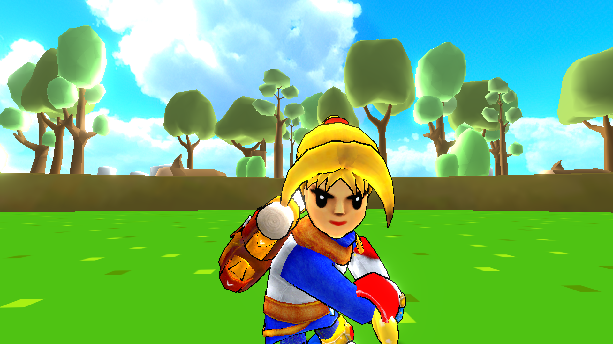  
リムライトなし  
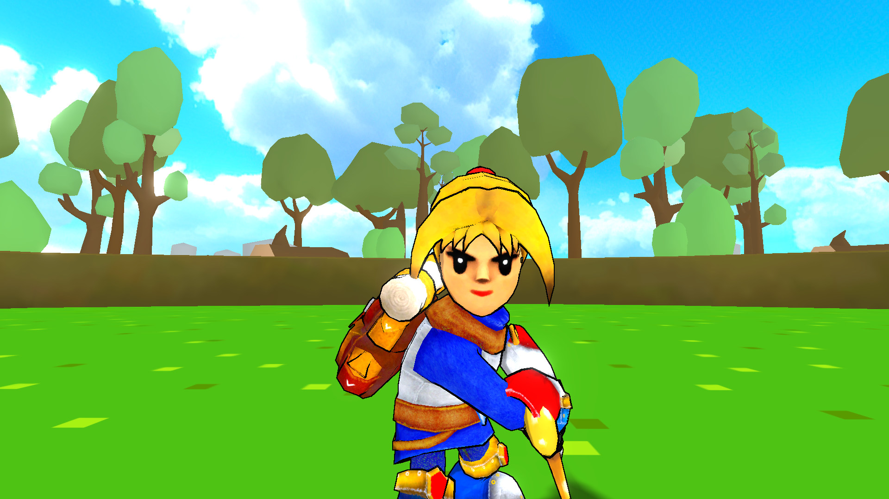  


1.まず、サーフェイスの法線を利用してリムライトの強さを求めます。
使用する法線は、カメラ空間における法線です。
```h
//カメラ空間にするための行列と法線ベクトルの乗算してカメラ空間の法線を求める
psIn.normalInView = mul(mView,psIn.normal);

//カメラ空間でのZ値の値を使って、リムライトの強さを計算する
float limLight = 1.0f - max(0.0f, psIn.normalInView.z * -1.0f);
```
psIn.normalInViewはカメラ空間の法線なので、カメラ方向を向いている法線のZ値は-1.0に近づいていき、リムライトの強さが弱くなります。逆にカメラに対して垂直に近づいている法線はZ値が0に近づいていき、リムライトの強さが強くなります。  
 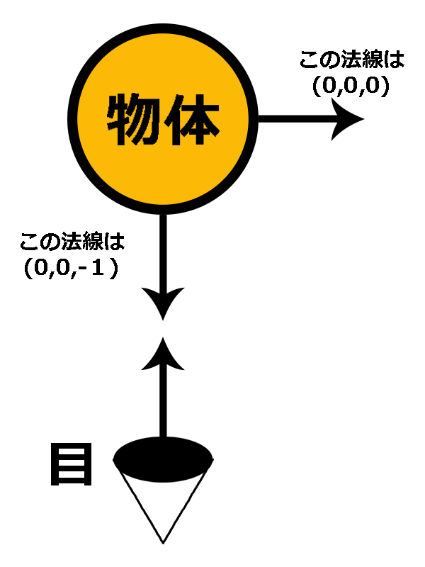  

| 法線のZ値 | 計算                           | リムライトの強さ | 
| :-------: | :----------------------------: | :--------------: | 
| 0.0f      | 1.0f - max(0.0f, 0.0f* -1.0f)  | 1.0f(100%)       | 
| -0.5f     | 1.0f - max(0.0f, 0.5f* -1.0f)  | 0.5f(50%)        | 
| -1.0f     | 1.0f - max(0.0f, -1.0f* -1.0f) | 0.0f(0%)         | 


2.求めたリムライトの強さをpow()関数で1.5乗することで、強さの変化を指数関数的にします。これは自然界の力の変化が指数関数的に変化するものが多いからです。
```h
// 累乗関数を使用して、強さの変化を指数関数的にする
// ×1.1fでリムライトの強さを1.1倍している
limLight = pow(limLight, 1.5f) * 1.1f;
```
3.最後に、ライティングした反射光とリムライトの反射光を合算し、最終的な反射光とアルベドテクスチャカラーを乗算して出力するカラーを求めました。  
```h
//ライティングした値とリムライトの反射光を合算する
float3 lig = directionLig + pointLig + 
					spotLig + hemiLig + finalAmbient + limLight;

//アルベドカラーをサンプリング
float4 albedoColor = g_albedo.Sample(g_sampler, psIn.uv);
//ライトを乗算
albedoColor.xyz*=lig;

```

  <div style="text-align: right;">

#### [目次に戻る](#目次)
</div>

---
